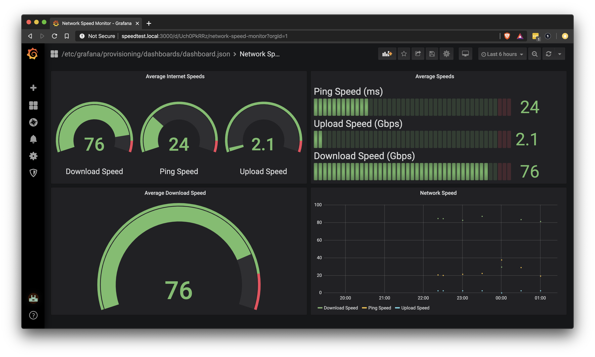

## Network Speed Monitor
This is an automatic provisioning of the [network speed monitor](https://pimylifeup.com/raspberry-pi-internet-speed-monitor/).
The speed monitor uses a cron job to run a python script every 30 mins. The script checks the speed of the network and writes the findings to an InfluxDB which is fed to Grafana for visualization.

The System hardening portion of the provisioning changes the hostname to `speedtest` and when it finishes, Grafana is automatically provisioned with a dashboard at `speedtest.local:3000`:

Creds are: speedtest:raspberry

